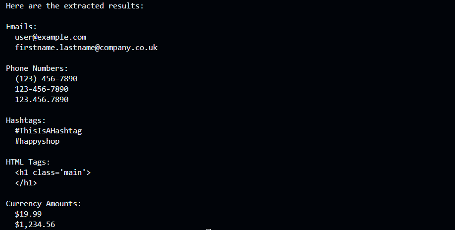

# alu_regex-data-extraction-ingdia
## Welcome to the Regex Data Extraxtion Project!

This project is made using python and regex(Regular Expression) to extract rael world data specifically : email, hashtags, phone number, html tag and currency.

## Project Overview
I extract and validate the following data types:
- Email addresses  for example: sample@gmail.com
- Phone numbers   for example: (123) 456-7890
- Html tags  for example: &lt;p&gt; Welcome &lt;/p&gt;
- Hashtags  for example: #ThisIsAHashtag
- Currency amounts  for example: $1,234.56
### techonlogy used 
- language: python3 , 
- libraries: re (built-in Python regex module),
- and regular expressions
## Features
- OOP- based architecture using PatternTypes and Extrector classes
- Regex patterns to match real-world text formats

## here is the Output 

